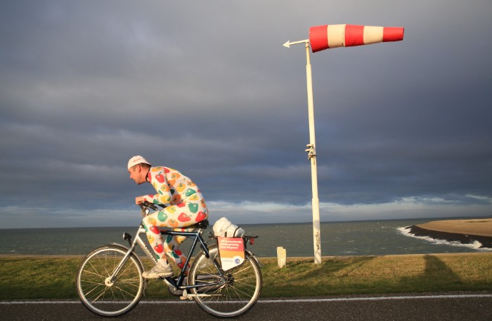

# ALTIJD WIND TEGEN

A simple script that takes a [.gpx file](https://www.topografix.com/gpx.asp) as an input, reads all the coordinates and calculates the bearing for each segment (defined by two pair of coordinates).

It then fetches the wind forecast (defaulting to the next morning currently) and calculates which percentage of the route you'll be against the wind. This currently expects a `MET_API_KEY` environment variable to be able to query the [Met Office](https://www.metoffice.gov.uk/services/data/datapoint/api)

Inspired by the heroes of [NK Tegenwindfietsen](https://en.wikipedia.org/wiki/Dutch_Headwind_Cycling_Championships) and the countless times where I've felt miserable on the road "headwinding".




```
pipenv install
pipenv shell
python -m altijd_wind_tegen.main

The main wind direction tomorrow will be SSW at 11 mph
Your ride (None) will be facing this direction 20.239999999999966 % of the time
The main wind direction tomorrow will be SSW at 11 mph
Your ride (None) will be facing this direction 16.37999999999999 % of the time
The main wind direction tomorrow will be SSW at 11 mph
Your ride (None) will be facing this direction 23.25 % of the time
The main wind direction tomorrow will be SSW at 11 mph
Your ride (None) will be facing this direction 10.879999999999995 % of the time
```


## TODO

- Get the name from the GPX file.
- Add more Weather Offices (currently UK (MetOffice)-only). / geospatial validation.
- Add more flexibility to decide the time of the ride (currently defaults to tomorrow morning).
- Add some actual tests.